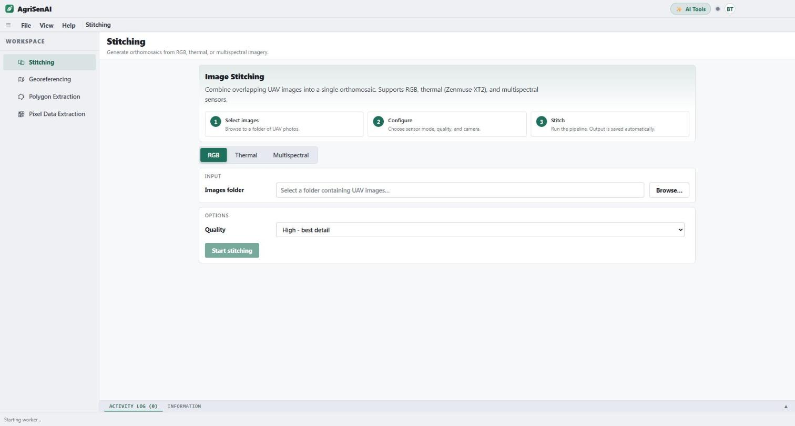
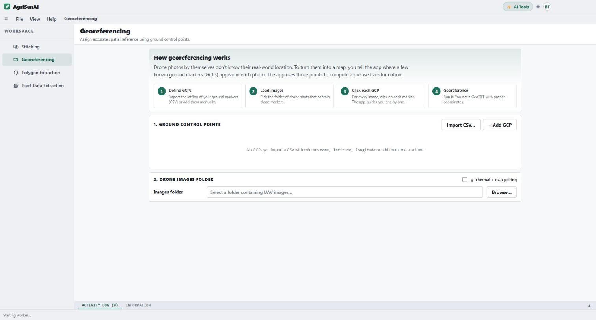
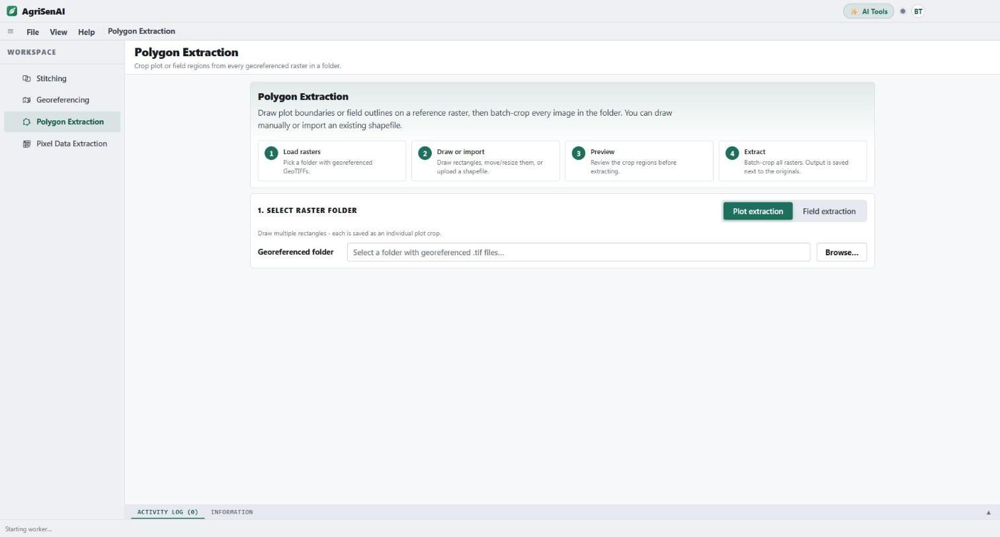
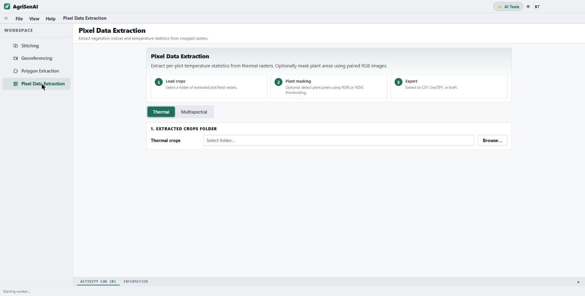
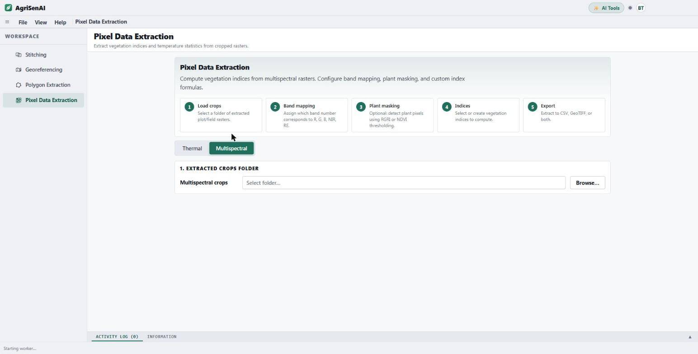
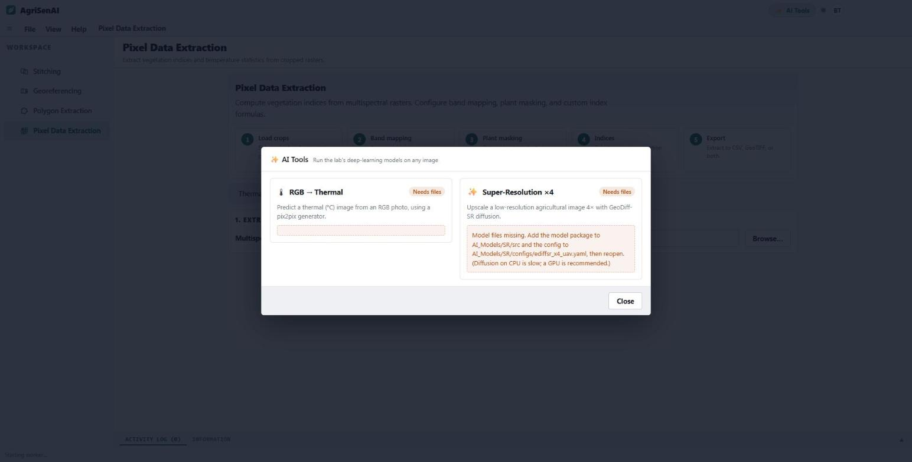
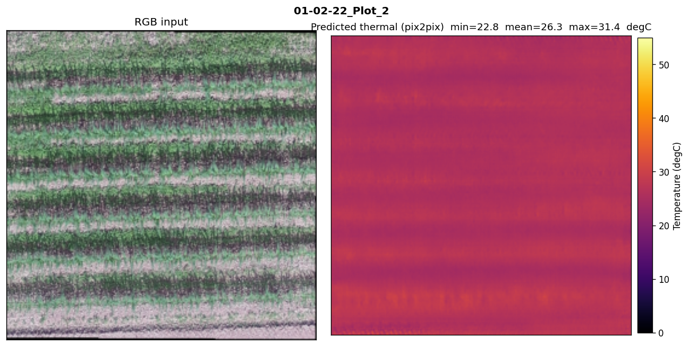
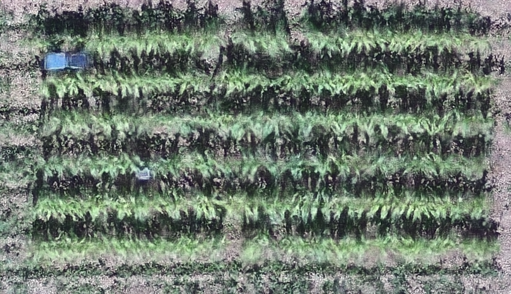
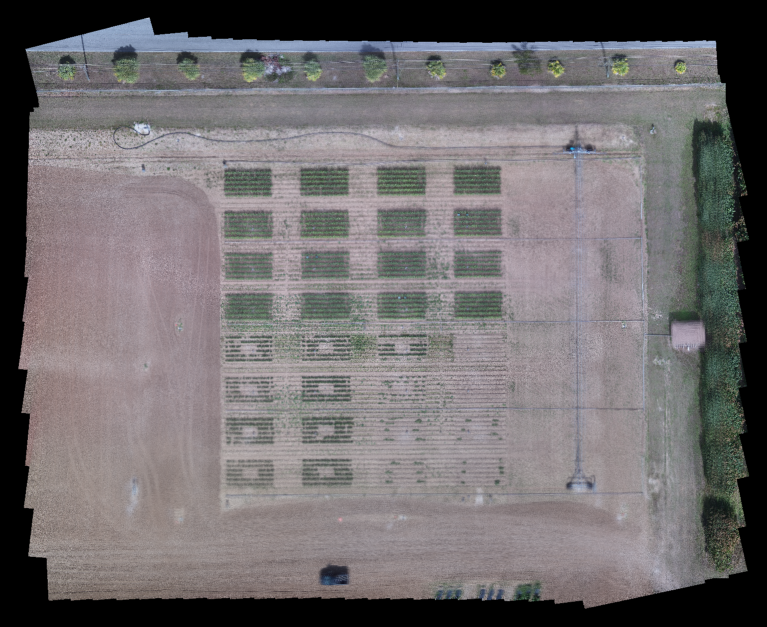
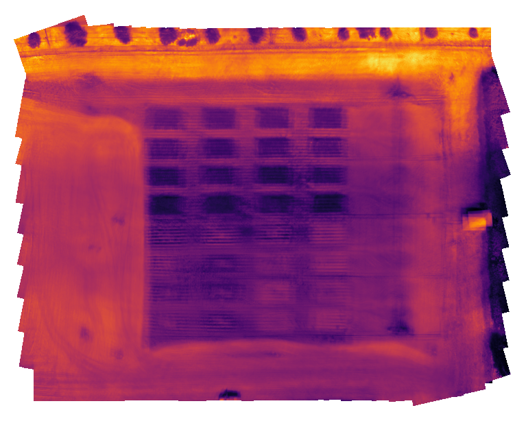

# AgriSenAI

**Automating UAV Thermal and Multispectral Image Processing for Precision Agriculture**

Water Resources Research Group · Agricultural and Biological Engineering · University of Florida

---

> ## 🚧 **Version 2 is in active development and will be available here soon.**
>
> **We are currently building the second version of AgriSenAI: a complete rewrite as a
> cross-platform desktop application with a new interface, a much faster processing
> engine, and built-in deep-learning tools. The functionalities of version 2 are
> documented with screenshots further down this page. Code, installers and
> documentation will be published in this repository when the release is ready.**

---

## Contents

- [What AgriSenAI is](#what-agrisenai-is)
- [Version 1 (published)](#version-1-published)
- [Version 2 functionalities](#version-2-functionalities)
  - [1. Image stitching](#1-image-stitching)
  - [2. Georeferencing](#2-georeferencing)
  - [3. Polygon extraction](#3-polygon-extraction)
  - [4. Pixel data extraction, thermal](#4-pixel-data-extraction-thermal)
  - [5. Pixel data extraction, multispectral](#5-pixel-data-extraction-multispectral)
  - [6. AI tools](#6-ai-tools)
- [What version 2 produces](#what-version-2-produces)
- [Architecture](#architecture)
- [Citation](#citation)
- [License and contact](#license-and-contact)

---

## What AgriSenAI is

AgriSenAI turns raw UAV flights into per-plot agronomic numbers. A single field
campaign produces hundreds of overlapping RGB, multispectral and thermal frames
that are of no use until they have been stitched, georeferenced, cut into plots
and reduced to canopy-only statistics. In a conventional workflow that chain
spans several programs, including photogrammetry software, a GIS package and
hand-written scripts, and every acquisition date has to be pushed through it
again by hand.

AgriSenAI performs the whole chain in one application, with the same plot
boundaries reused across dates and modalities, so results are reproducible
between flights and between operators.

---

## Version 1 (published)

Version 1 is a Python desktop application, published as a software paper in
*SoftwareX*:

> Tulu, B.B., Teshome, F., Ampatzidis, Y., Hailegnaw, N.S., Bayabil, H.K. (2025).
> AgriSenAI: Automating UAV thermal and multispectral image processing for
> precision agriculture. *SoftwareX*, 30, 102083.
> https://doi.org/10.1016/j.softx.2025.102083

It covers field and plot extraction, canopy detection, and per-pixel export of
canopy temperature and vegetation indices, and it was validated against an
equivalent manual QGIS workflow.

---

## Version 2 functionalities

Version 2 keeps the same processing goals and rebuilds everything around them:
a new interface, a photogrammetry engine that runs locally, cancellable
background jobs with live progress, and the lab's deep-learning models built
into the application.

The screenshots below are of the version 2 interface as it currently stands in
development. They are previews of work in progress, not a released build.

### 1. Image stitching

Combine overlapping UAV frames into a single orthomosaic. Three sensor modes are
supported: **RGB**, **thermal** (Zenmuse XT2) and **multispectral**. Photogrammetry
runs locally through an OpenDroneMap engine, so no imagery leaves the machine
and no cloud subscription is involved.

- Browse to a folder of UAV photos; the application detects the sensor type,
  reads the EXIF geotags and infers the UTM coordinate system
- Quality presets trade processing time against detail
- Progress and a live log for every stage, and jobs can be cancelled
- Multispectral stitching also writes one single-band GeoTIFF per band
  alongside the stacked product
- Each run saves a processing report with quality figures, including the
  orthomosaic preview, the match graph, image overlap and a camera heat map



### 2. Georeferencing

Give an orthomosaic a real-world coordinate system from ground control points.

- Import GCPs from a CSV with `name`, `latitude`, `longitude` columns, or add
  them one at a time
- The application steps through each image and asks you to click each marker,
  one GCP at a time, so nothing is missed
- Computes the transformation and writes a GeoTIFF with proper coordinates
- **Thermal and RGB pairing**: place the GCPs once and apply them to both
  modalities, which keeps the two rasters on an identical pixel grid



### 3. Polygon extraction

Cut the orthomosaic into the regions you actually analyse.

- **Plot extraction**: draw multiple rectangles, each saved as its own plot crop
- **Field extraction**: isolate the experimental field from the wider mosaic
- Draw boundaries by hand, or import an existing shapefile or GeoJSON
- Preview the crop regions before committing
- Batch-crops every raster in the folder, so one set of boundaries is applied
  across all dates and all modalities



### 4. Pixel data extraction, thermal

Reduce cropped thermal rasters to per-plot canopy temperature statistics.

- Optional **plant masking** separates canopy pixels from soil and background by
  RGRI or NDVI thresholding, so the statistics describe the crop and not the
  ground between rows
- Exports to CSV, GeoTIFF, or both



### 5. Pixel data extraction, multispectral

The same step for multispectral rasters, with vegetation indices.

- **Band mapping**: tell the application which band number is R, G, B, NIR and
  red edge, so any sensor layout is supported
- Preset indices: **NDVI, GNDVI, NDRE, SAVI, OSAVI, EVI, MSAVI2, VARI, GLI, RGRI**
- **Custom index builder**: write your own formula from the mapped bands rather
  than being limited to the preset list
- The same plant masking and export options as the thermal path



### 6. AI tools

The lab's deep-learning models, built into the application and run locally on
any image.

- **RGB → Thermal.** Predicts a thermal image from an ordinary RGB photo using a
  pix2pix generator, so canopy-temperature information can be estimated where no
  radiometric thermal payload was flown. It is intended as a proxy for
  radiometric thermal measurement, useful for relative, treatment-level
  comparison, and not as a replacement for a calibrated thermal sensor.
- **Super-Resolution ×4.** Upscales a low-resolution agricultural image four
  times with GeoDiff-SR, a conditional diffusion model trained to preserve the
  agronomic content that downstream analysis depends on, rather than merely to
  look sharp.



Example outputs from the two models:

RGB input and the predicted thermal image, side by side:



Four-times super-resolution of a low-resolution plot image:



---

## What version 2 produces

| Output | Description |
| --- | --- |
| Orthomosaic GeoTIFF | One per sensor mode, written to `AgriSenAI_output/` next to the input imagery |
| Per-band GeoTIFFs | Individual bands alongside the stacked multispectral product |
| Processing report | PDF with the orthomosaic preview, match graph, image overlap and camera heat map |
| Georeferenced raster | GeoTIFF with the coordinate system applied from the ground control points |
| Plot and field crops | One raster per drawn or imported polygon, batched across the whole folder |
| Per-pixel CSV | One row per canopy pixel, with plot identifier, pixel coordinates and the extracted value |
| Index rasters | GeoTIFF per computed vegetation index |
| AI model outputs | Predicted thermal images and four-times super-resolved images |

Example stitched products:

| RGB orthomosaic | Thermal orthomosaic |
| --- | --- |
|  |  |

---

## Architecture

Version 2 is an Electron and React front end over a long-lived Python worker.

```
Electron (main process)
  └── BrowserWindow ──────────── React + Vite interface
  └── Python worker ──────────── one long-lived subprocess
        │                        JSON-lines over stdin/stdout
        ├── detect     EXIF scan, coordinate-system inference, sensor sniffing
        ├── stitching  photogrammetry through a local OpenDroneMap engine
        ├── georef     ground control points, thin plate spline transform
        ├── extract    plot and field polygon extraction
        └── pixels     canopy masking, vegetation indices, per-pixel export
```

Keeping one Python process alive for the whole session means the heavy
geospatial libraries are imported once rather than per job, and every job
reports progress and can be cancelled while it runs.

---

## Citation

If you use AgriSenAI in your work, please cite the software paper:

```bibtex
@article{Tulu2025AgriSenAI,
  title   = {AgriSenAI: Automating UAV thermal and multispectral image
             processing for precision agriculture},
  author  = {Tulu, Boaz B. and Teshome, Fitsum and Ampatzidis, Yiannis and
             Hailegnaw, Niguss Solomon and Bayabil, Haimanote K.},
  journal = {SoftwareX},
  volume  = {30},
  pages   = {102083},
  year    = {2025},
  doi     = {10.1016/j.softx.2025.102083}
}
```

---

## License and contact

Released under the license in [LICENSE](LICENSE).

Boaz B. Tulu · btulu@ufl.edu
Water Resources Research Group, University of Florida
